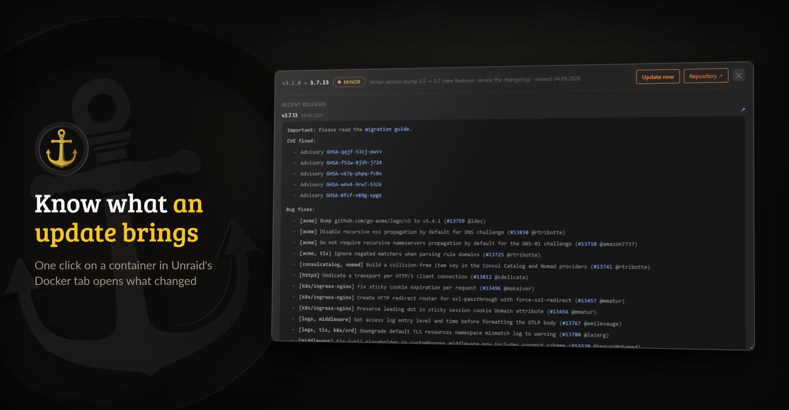
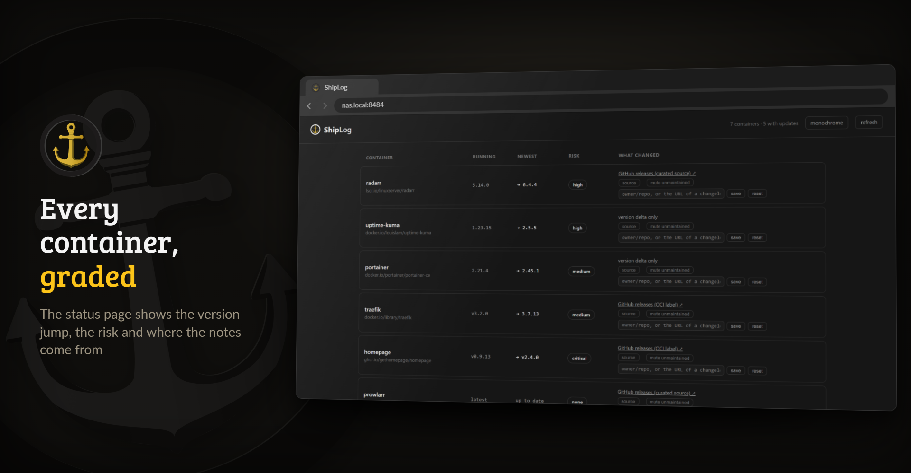

<p align="center">
  <picture>
    <source media="(prefers-color-scheme: dark)" srcset="https://raw.githubusercontent.com/junkerderprovinz/shiplog/main/.github/assets/shiplog-banner-dark.png">
    
  </picture>
</p>

<p align="center">
  <a href="https://github.com/junkerderprovinz/shiplog/actions/workflows/build.yml"></a>&nbsp;
  <a href="https://github.com/junkerderprovinz/shiplog/actions/workflows/lint.yml"></a>&nbsp;
  <a href="https://hub.docker.com/r/junkerderprovinz/shiplog"></a>&nbsp;
  <a href="https://hub.docker.com/r/junkerderprovinz/shiplog"></a>&nbsp;
  <a href="https://github.com/junkerderprovinz/shiplog/pkgs/container/shiplog"></a>&nbsp;
  <a href="https://ca.unraid.net/apps/shiplog-1lpuit5150ztw5"></a>&nbsp;
  <a href="LICENSE"></a>
</p>

<br>

<p align="center">
⚓ <b>ShipLog</b> reads the changelog before you update, right inside Unraid's native <b>Docker tab</b>. Next to each container it shows <b>what actually changes</b> between your running image and the newest: the release notes, a deterministic <b>risk badge</b> (patch / minor / major) and the real <b>version jump</b> (e.g. 1.7 → 1.8).<br>
<br>
<b>Read-only</b>: it never pulls, recreates or stops anything. Optional: AI changelog summaries via a local Ollama, and Matrix notifications.
</p>

<!-- download-buttons: written by scripts/gen_download_buttons.py -->
<p align="center">
  <a href="https://ca.unraid.net/apps/shiplog-1lpuit5150ztw5"></a>
  &nbsp;
  <a href="https://github.com/junkerderprovinz/shiplog/releases/latest"></a>
</p>
<!-- /download-buttons -->

<br>

<p align="center">
A one-knight job: I build it, keep it running, work through the issues and add what people ask for, until nothing is missing. It is free, with no accounts, no telemetry, no ads and no paid tier. No asterisk anywhere. Nothing readable ever leaves your own walls. Forged on evenings and weekends, with heart and stubbornness.
</p>

<p align="center">
If it has earned a place on your server or computer, toss a coin to your knight: it helps cover the costs and keeps the project alive. It also makes this knight's heart beat a little faster. Three ways below, whichever suits you.
</p>

<!-- give-buttons: written by scripts/gen_download_buttons.py -->
<p align="center">
  <a href="https://buymeacoffee.com/junkerderprovinz"></a>
  &nbsp;
  <a href="https://www.paypal.com/donate/?hosted_button_id=76FVV52TKXTUS"></a>
  &nbsp;
  <a href="https://junkerderprovinz.github.io/junkerderprovinz/"></a>
</p>
<!-- /give-buttons -->

<br>

## Table of Contents

1. [What it looks like](#1-what-it-looks-like)
2. [What it does](#2-what-it-does)
3. [Getting started](#3-getting-started)
4. [How AI is used here](#4-how-ai-is-used-here)
5. [Support this project](#5-support-this-project)

<br>

## 1. What it looks like

The containers in these pictures run public images at older versions in a test sandbox; the release notes are the real ones.

<p align="center">
  
  <br><em>The changelog window opens from the chip ShipLog adds to every container in the Docker tab</em>
</p>

<p align="center">
  
  <br><em>The engine's status page on port 8484, the same data without Unraid</em>
</p>

<br>

## 2. What it does

- **What changed, not just "update available".** A Changelog chip sits on every container in the Docker tab. Its window shows the release notes between your running tag and the newest, with the real version jump.
- **A risk badge you can trust.** Patch is low, minor medium, major high. A release note in the span that flags a breaking change, such as a required migration, raises it to critical and sends an alert.
- **Honest when it does not know.** If no changelog can be found, it says so and shows what it does know. Digest-pinned and locally built images are labelled as such instead of showing a bogus update.
- **Fix a wrong changelog source.** Point any image at the right GitHub repository or at a changelog file such as `CHANGELOG.md`; the choice survives container recreation.
- **Warns about dead ends.** An app pulled from Community Applications, an image gone from its registry or an archived source repository replaces the chip with a red badge. An app Community Applications only hides from its default search gets an amber one.
- **Updates through Unraid.** An Update all button and an optional scheduled auto-update, limited to the level you choose, hand the work to Unraid's own update. ShipLog checks afterwards that the new image really runs. The engine itself never writes to the Docker socket.
- **Optional extras, off by default.** Changelog summaries from a local Ollama, Matrix messages and Unraid notifications.
- **26 languages**, following Unraid's own setting.

<br>

## 3. Getting started

On Unraid, install ShipLog from [Community Applications](https://ca.unraid.net/apps/shiplog-1lpuit5150ztw5). It is a plugin, not a container. You can also paste this address under **Plugins → Install Plugin**:

```
https://raw.githubusercontent.com/junkerderprovinz/shiplog/main/plugin/shiplog.plg
```

The chips appear in the Docker tab after the first check. The settings are under **Settings → ShipLog**, where a GitHub token raises the rate limit for release notes and the auto-update is switched on.

On any other Docker host the engine runs on its own and serves the status page, without the Docker tab and without updates:

```sh
docker run -d --name shiplog -p 8484:8484 \
  -v /var/run/docker.sock:/var/run/docker.sock:ro \
  -v /path/to/config:/config \
  junkerderprovinz/shiplog:latest
```

The status page has no login, so keep port 8484 inside your network.

<br>

## 4. How AI is used here

One knight builds this, and AI is one of the tools I work with, the same way I work with an editor or a compiler. It helps me write code and documentation and it checks my work, and that saves me a good many evenings. It does not make the decisions, though. I read and understand everything before it ships, and if something here breaks, that is on me and not on the tool.

You do not have to take my word for it. The code is open and every release note is written by hand. The issue tracker shows how problems actually get handled, including the ones I got wrong the first time. If you find something that is not right, open an issue and I will look at it.

<br>

## 5. Support this project

Questions? Check the [support thread](https://forums.unraid.net/topic/199510-support-junkerderprovinz-shiplog/). Bugs, ideas or feature requests? Please [open a GitHub issue](https://github.com/junkerderprovinz/shiplog/issues).

A one-knight job: I build it, keep it running, work through the issues and add what people ask for, until nothing is missing. It is free, with no accounts, no telemetry, no ads and no paid tier. No asterisk anywhere. Nothing readable ever leaves your own walls. Forged on evenings and weekends, with heart and stubbornness.

If it has earned a place on your server or computer, toss a coin to your knight: it helps cover the costs and keeps the project alive. It also makes this knight's heart beat a little faster. Three ways below, whichever suits you.

<!-- give-buttons: written by scripts/gen_download_buttons.py -->
<p align="center">
  <a href="https://buymeacoffee.com/junkerderprovinz"></a>
  &nbsp;
  <a href="https://www.paypal.com/donate/?hosted_button_id=76FVV52TKXTUS"></a>
  &nbsp;
  <a href="https://junkerderprovinz.github.io/junkerderprovinz/"></a>
</p>
<!-- /give-buttons -->

<sub>ShipLog is licensed under the AGPL-3.0, which covers the code only: the name "ShipLog" and its logo are reserved, so a fork needs its own name and branding.</sub>
